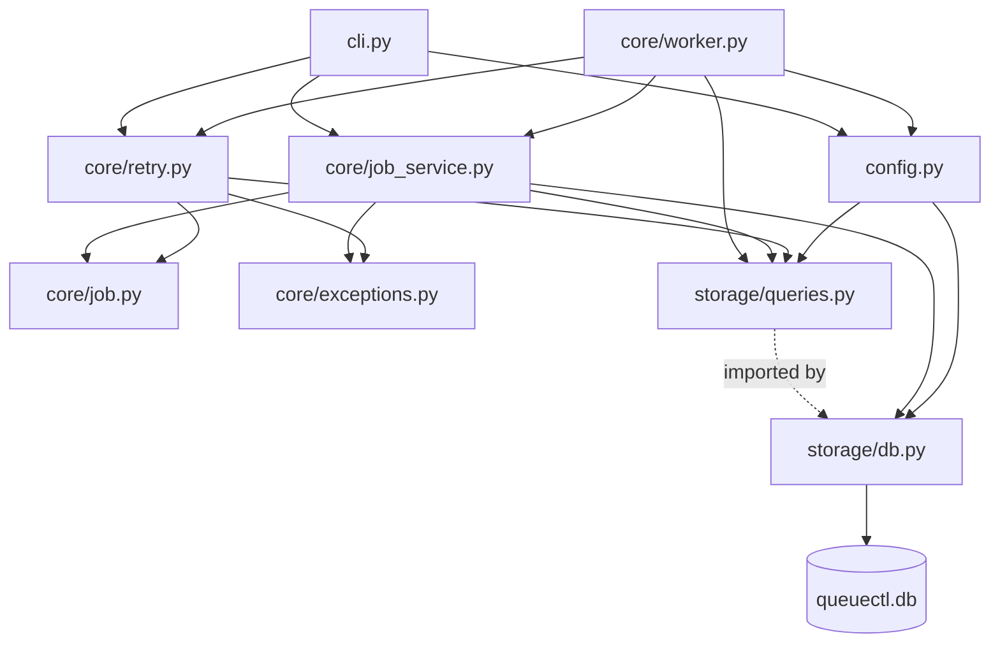
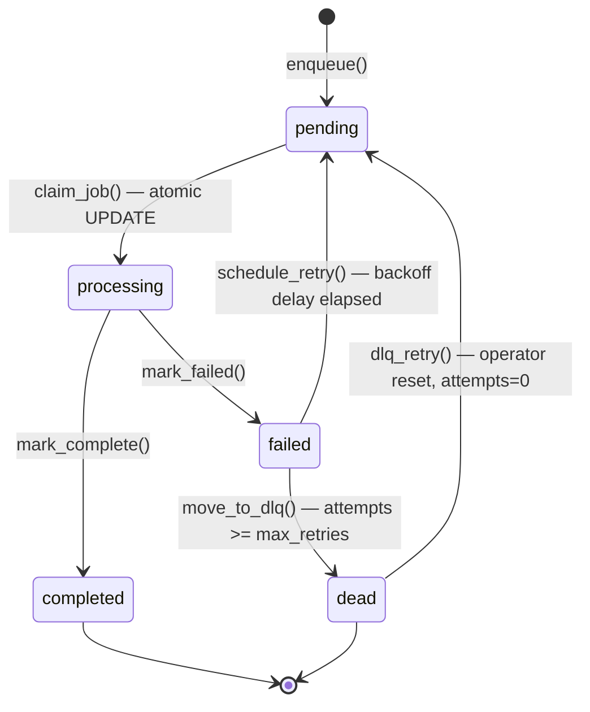
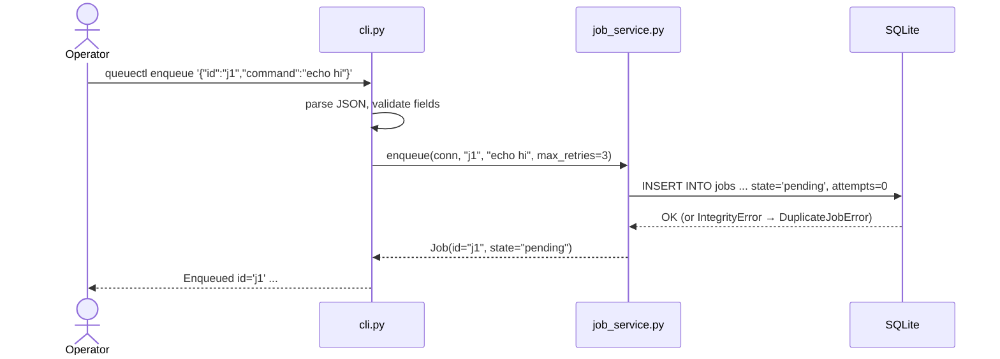
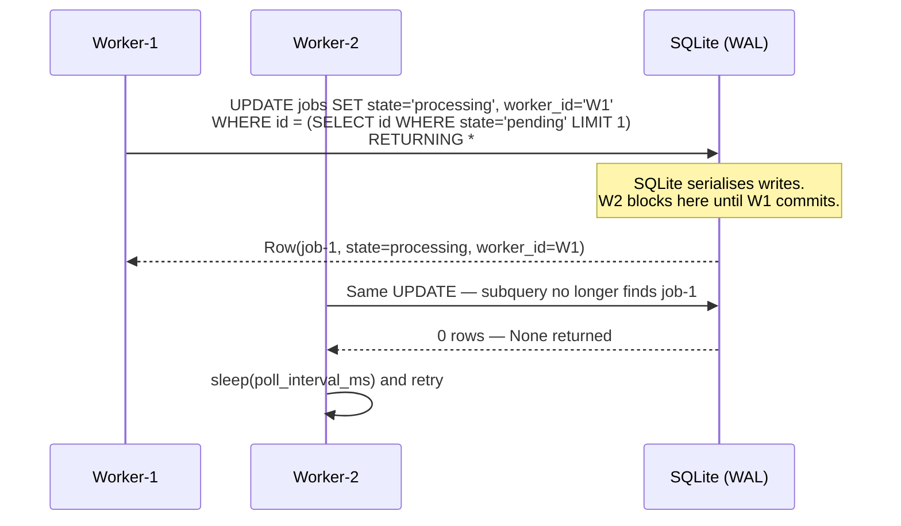
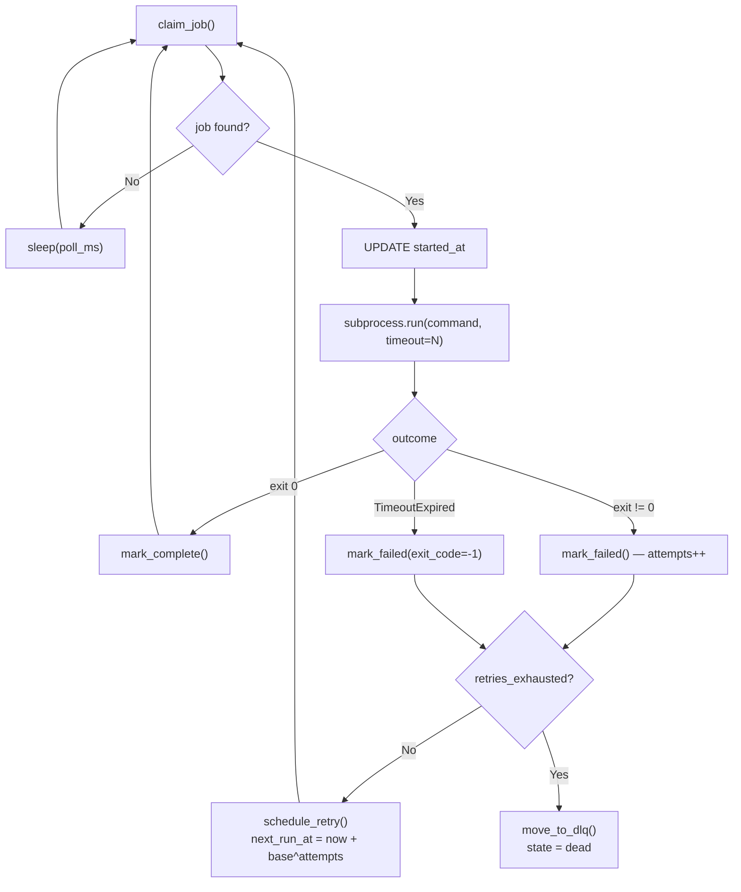
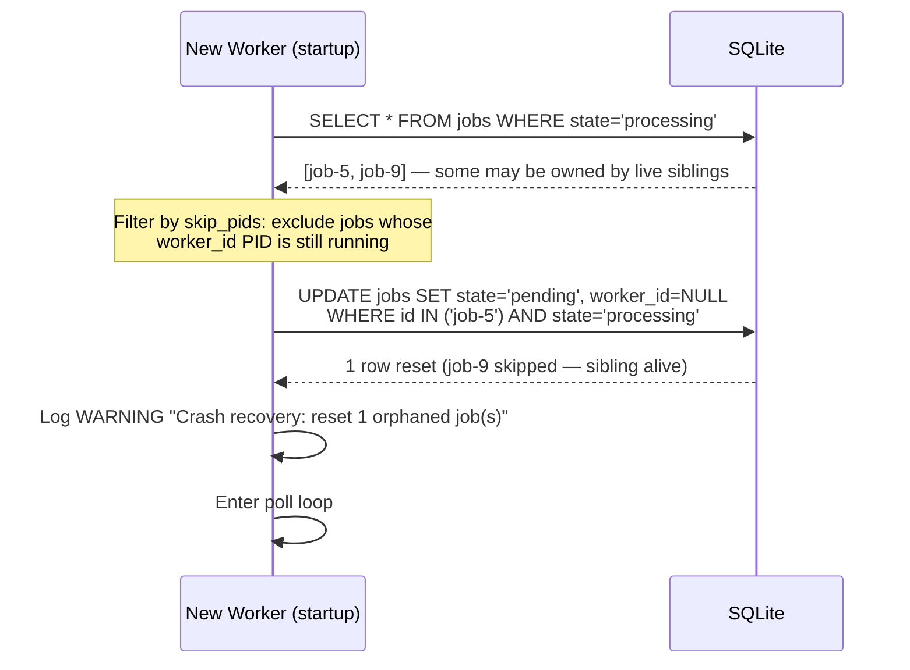

# QueueCTL — Architecture & Workflow Reference

> Current as of **Phase 4 (complete)**. Updated after each phase.

---

## 1. System Overview

QueueCTL is a **CLI-driven background job queue** backed by SQLite.
It is intentionally single-binary: one Python package handles enqueueing,
execution, retry, DLQ management, and configuration with no external
dependencies beyond the standard library and `click`.

```
Operators / CI scripts
        │
        ▼  CLI commands (queuectl enqueue / status / list / dlq / config)
    ┌───────┐
    │ cli.py│  ← thin adapter — parses args, calls service, formats output
    └───────┘
        │
        ▼
    ┌───────────────────────────────────────┐
    │              core/                    │
    │  job.py        job_service.py         │
    │  retry.py      worker.py             │
    │  exceptions.py                        │
    └───────────────────────────────────────┘
        │
        ▼
    ┌─────────────────────┐      ┌──────────────────┐
    │    storage/         │      │    config.py      │
    │  db.py  queries.py  │◄─────│  (config table    │
    └─────────────────────┘      │   wrapper)        │
        │                        └──────────────────┘
        ▼
    ┌──────────────────┐
    │  queuectl.db     │  ← single SQLite file (WAL mode)
    │  ┌────────────┐  │
    │  │    jobs    │  │
    │  ├────────────┤  │
    │  │   config   │  │
    │  └────────────┘  │
    └──────────────────┘
```

**Dependency rule (enforced, never violated):**
```
cli.py  →  core/*  →  storage/*
config.py           →  storage/*
(nothing imports back up the chain)
```

---

## 2. Module Dependency Graph



---

## 3. Job State Machine

Every job moves through a strict state machine. Transitions not listed here
are **illegal** and raise `InvalidStateTransitionError`.



**Key timestamps on each job row:**

| Field | Set when |
|-------|----------|
| `created_at` | `enqueue()` |
| `updated_at` | every state transition |
| `picked_at` | `claim_job()` — when the claim query ran |
| `started_at` | `_execute_job()` — just before `subprocess.run` |
| `finished_at` | `mark_complete()` / `mark_failed()` |
| `next_run_at` | `schedule_retry()` — `now + backoff_delay` |

---

## 4. Critical Path: End-to-End Job Flow

### 4a. Enqueue



### 4b. Atomic Claim (the concurrency guarantee)



### 4c. Execution + Failure + Retry



### 4d. Crash Recovery



---

## 5. Exponential Backoff Formula

```
delay = min(backoff_base ^ attempts, MAX_BACKOFF_SECONDS)

Defaults (backoff_base=2, MAX_BACKOFF_SECONDS=300):
  attempt 1 →   2s
  attempt 2 →   4s
  attempt 3 →   8s
  attempt 4 →  16s
  attempt 5 →  32s
  attempt 8 → 256s
  attempt 9 → 300s  (capped)
```

`backoff_base` is read from the `config` table and overridable via
`queuectl config set backoff-base <N>`.

---

## 6. Concurrency Model

| Layer | Mechanism |
|-------|-----------|
| **Claim atomicity** | Single `UPDATE … WHERE id = (SELECT … LIMIT 1) RETURNING *` — SQLite serializes all writes so no two workers can match the same row |
| **Reader concurrency** | WAL mode — readers never block writers, writers never block readers |
| **Write contention** | `PRAGMA busy_timeout = 5000` — workers wait up to 5s for the write lock before raising `OperationalError` |
| **Process isolation** | Each worker OS process has its own `sqlite3.Connection` — connections are never shared across process boundaries |
| **Crash safety** | `with conn:` wraps every write — SQLite rolls back incomplete transactions automatically on crash |

---

## 7. File & Module Map

```
queuectl/
│
├── cli.py                  ← Entrypoint. Thin adapter between user and core.
│                             Parses click args, calls service functions,
│                             formats output. Never contains business logic.
│
├── config.py               ← Config table CRUD. Converts CLI hyphenated keys
│                             (max-retries) to DB underscore keys (max_retries).
│                             Typed getters: get_int_config, get_float_config.
│
├── seed_jobs.py            ← Demo seeder. Calls the service layer directly to
│                             enqueue sample jobs — bypasses shell quoting issues
│                             on Windows PowerShell. Mirrors the CLI's own code path.
│
├── simulate_crash.py       ← Injects a fake orphaned 'processing' job into the DB
│                             to reproduce a crashed-worker scenario without killing
│                             a real process. Pair with 'worker start' to observe
│                             crash recovery in action.
│
├── core/
│   ├── job.py              ← Job dataclass + state machine constants.
│   │                         JobState, VALID_TRANSITIONS, OUTPUT_TRUNCATION_LIMIT.
│   │                         Job.from_row() deserialises a sqlite3.Row.
│   │                         Job.retries_exhausted property.
│   │
│   ├── exceptions.py       ← Domain exceptions: DuplicateJobError,
│   │                         JobNotFoundError, InvalidStateTransitionError.
│   │                         No raw sqlite3 errors ever reach the CLI.
│   │
│   ├── job_service.py      ← Business logic for job lifecycle.
│   │                         enqueue, get_job, claim_job (atomic),
│   │                         mark_complete, mark_failed, list_jobs,
│   │                         get_job_counts.
│   │
│   ├── retry.py            ← Backoff + DLQ logic.
│   │                         calculate_backoff (pure function, no DB dep),
│   │                         schedule_retry, move_to_dlq,
│   │                         handle_failure (retry vs DLQ decision),
│   │                         dlq_retry (operator reset).
│   │
│   └── worker.py           ← Subprocess execution loop.
│                             Worker class: run(), _recover_orphaned_jobs(),
│                             _execute_job(). SIGINT/SIGTERM → clean shutdown.
│                             _recover_orphaned_jobs() accepts skip_pids to avoid
│                             resetting jobs owned by live sibling workers.
│                             _worker_process_main() — multiprocessing entry point.
│
├── storage/
│   ├── db.py               ← Connection factory. WAL mode, row_factory,
│   │                         busy_timeout=5000, idempotent schema init.
│   │                         get_connection(db_path) reads QUEUECTL_DB_PATH env.
│   │
│   └── queries.py          ← ALL SQL strings, centralized.
│                             Phase 2 (job DML), Phase 3 (retry/DLQ/config),
│                             Phase 4 (crash recovery, started_at).
│                             No raw SQL in any other module.
│
└── tests/
    ├── conftest.py         ← tmp_db fixture (file-based, isolated per test).
    ├── test_schema.py      ← Phase 1: 21 tests (schema, WAL, idempotency).
    ├── test_job_service.py ← Phase 2: 58 tests (service layer, atomic claim).
    ├── test_retry.py       ← Phase 3: 53 tests (backoff, DLQ, config).
    ├── test_worker.py      ← Phase 4: 31 tests (execution, crash recovery).
    └── test_concurrency.py ← Phase 5:  5 multiprocessing stress tests.
```

---

## 8. Configuration Reference

All config is stored in the `config` table. Changes take effect on next
worker restart.

| CLI key | DB key | Type | Default | Constraint |
|---------|--------|------|---------|------------|
| `max-retries` | `max_retries` | int | `3` | >= 0 |
| `backoff-base` | `backoff_base` | float | `2` | >= 1.0 |
| `timeout-seconds` | `timeout_seconds` | int | `300` | >= 1 |
| `poll-interval-ms` | `poll_interval_ms` | int | `500` | >= 100 |

```bash
queuectl config set max-retries 5
queuectl config get backoff-base
```

---

## 9. CLI Command Reference

```
queuectl
├── enqueue <JOB_JSON>          Enqueue a job from a JSON spec
│     {"id":"…","command":"…","max_retries":N}
├── status                      Show job counts by state
├── list [--state STATE]        List jobs (all or filtered)
│
├── worker
│   ├── start [--count N]       Start N worker processes (default 1)
│   └── stop                    Advisory — send Ctrl+C / SIGINT to workers
│
├── dlq
│   ├── list                    Show all dead jobs
│   └── retry <JOB_ID>          Reset dead job to pending (attempts=0)
│
└── config
    ├── set <KEY> <VALUE>        Update a config value
    └── get <KEY>               Show current value of a config key
```

---

## 10. SQLite Schema (current)

```sql
CREATE TABLE jobs (
    id           TEXT PRIMARY KEY,
    command      TEXT NOT NULL,
    state        TEXT NOT NULL DEFAULT 'pending'
                 CHECK(state IN ('pending','processing','completed','failed','dead')),
    attempts     INTEGER NOT NULL DEFAULT 0,
    max_retries  INTEGER NOT NULL DEFAULT 3,
    worker_id    TEXT,
    exit_code    INTEGER,
    stdout       TEXT,
    stderr       TEXT,
    next_run_at  TEXT,
    created_at   TEXT NOT NULL,
    updated_at   TEXT NOT NULL,
    picked_at    TEXT,
    started_at   TEXT,
    finished_at  TEXT
);

CREATE INDEX IF NOT EXISTS idx_jobs_state_created
    ON jobs (state, created_at);   -- claim query uses this

CREATE TABLE config (
    key   TEXT PRIMARY KEY,
    value TEXT NOT NULL
);
```

---

## 11. Test Coverage Summary

| Phase | File | Tests | What it proves |
|-------|------|-------|----------------|
| 1 | `test_schema.py` | 21 | Schema integrity, WAL mode, idempotent init |
| 2 | `test_job_service.py` | 58 | Service layer, atomic claim single-process, FIFO, truncation |
| 3 | `test_retry.py` | 53 | Backoff formula, DLQ movement, config CRUD |
| 4 | `test_worker.py` | 31 | Subprocess execution, crash recovery, sibling-aware orphan filtering, timeout |
| 5 | `test_concurrency.py` | 5 | No double-claim under real multiprocessing contention |
| **Total** | | **168** | |

---

## 12. Design Decisions Log

| Decision | Rationale |
|----------|-----------|
| SQLite over Redis/Postgres | Zero infrastructure for a CLI tool; WAL mode gives adequate concurrent write throughput for the assignment scope |
| Single `UPDATE…RETURNING` for claim | Atomic at the DB engine level — no application-level lock, no TOCTOU race. Works identically whether 1 or 100 workers |
| `with conn:` on every write | Explicit commit/rollback boundary — no silent partial writes |
| `check_same_thread=False` | Required for multiprocessing tests; each process owns its connection |
| `busy_timeout=5000` | Workers retry on contention instead of crashing; 5s is conservative |
| `RETURNING *` on claim + fail | Avoids a second `SELECT` to get the updated row — one round-trip, always consistent |
| `started_at` ≠ `picked_at` | Audit trail distinction: claim vs. actual subprocess start; useful for detecting scheduling overhead |
| All SQL in `storage/queries.py` | Single place to review, optimize, or mock SQL; prevents scattered string literals |
| Config in DB not file | No separate config file to manage; `config set` changes take effect DB-side without redeploying |
| `exceptions.py` not in EDD file list | Implementation detail within `core/` — no architectural impact; added for clean error boundary |
